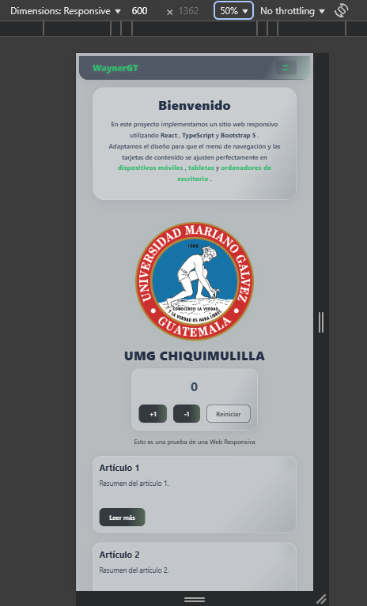
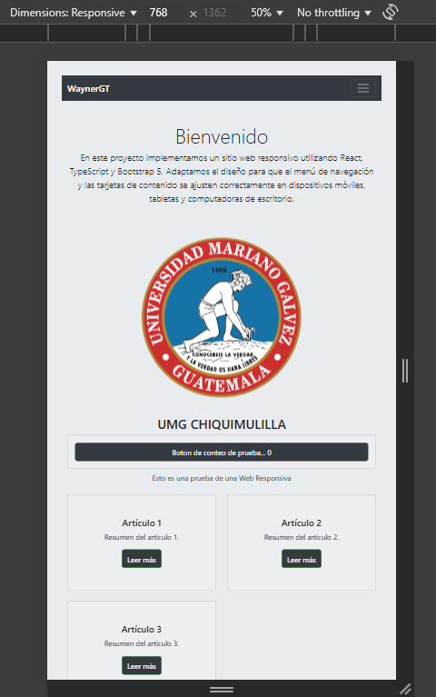
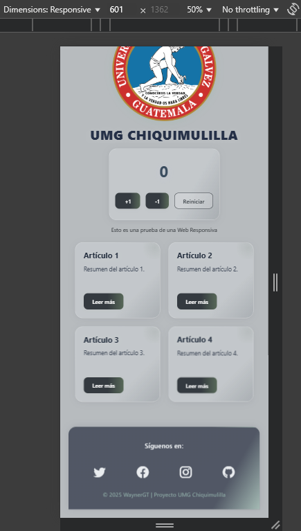
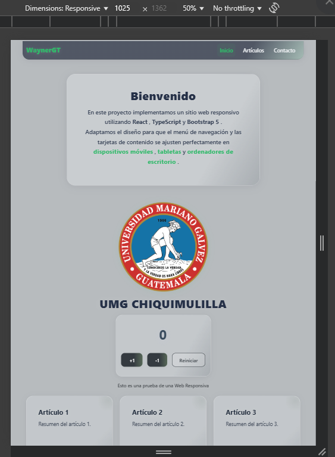

# Web Responsivo

## 📸 Capturas de Pantalla

A continuación se muestran capturas del diseño en las tres vistas principales:

### Vista Móvil (≤ 600px)

### Vista Tableta (601px - 1024px)

### Vista Escritorio (> 1024px)

---

## 🖥️ Tecnologías Utilizadas

El desarrollo de esta aplicación se realizó empleando las siguientes tecnologías y herramientas principales:

- **[Vite](https://vitejs.dev/):** Bundler moderno y ultrarrápido para desarrollo y build de la aplicación.
- **[React](https://react.dev/):** Librería principal para la construcción de la interfaz de usuario basada en componentes.
- **[TypeScript](https://www.typescriptlang.org/):** Superset de JavaScript que añade tipado estático para mayor robustez y mantenibilidad.
- **[Bootstrap 5](https://getbootstrap.com/):** Framework CSS utilizado para el sistema de grid responsivo, utilidades, y componentes como la navbar y las tarjetas.
- **CSS personalizado (App.css):** Para la personalización de colores, transparencias y ajustes finos de responsividad mediante media queries.

---

## 🧭 Enfoque de Diseño Responsivo

La aplicación utiliza una combinación del sistema de grid de **Bootstrap 5** y media queries personalizadas en el archivo `App.css` para cumplir con los requerimientos exactos del enunciado:

- **Breakpoints personalizados:**  
  - **Móvil (≤600px):** Las tarjetas se apilan en una sola columna. El menú de navegación se convierte en hamburguesa.
  - **Tableta (601px - 1024px):** Las tarjetas se distribuyen en dos columnas exactas. El menú se expande horizontalmente.
  - **Escritorio (>1024px):** Las tarjetas se muestran en tres columnas exactas. El menú siempre está expandido.

- **Media queries personalizadas:**  
  Los ajustes de tipografía, márgenes, paddings y otros detalles visuales se realizan en `App.css` para afinar la experiencia en cada breakpoint definido en el enunciado.

- **Estilos modernos y coherentes:**  
  Se personalizaron colores de fondo, navbar y botones para lograr una estética moderna y consistente en todos los dispositivos.

---

## 🚀 Enlace de la Aplicación Desplegada

Puedes ver la aplicación funcionando en el siguiente enlace:

[https://web-responsiva.vercel.app/](https://web-responsiva.vercel.app/)

---

## 📂 Estructura de Capturas

Para asegurar la visualización de las imágenes, coloca las capturas de pantalla en la carpeta `/screenshots` junto a este archivo, con los siguientes nombres:
- `mobile.png`
- `tablet.png`
- `tablet2.png`
- `desktop.png`

---

## 💡 Observaciones

- El proyecto está optimizado para cumplir con los estándares modernos de usabilidad y accesibilidad.
- Puedes personalizar el diseño responsivo modificando tanto las utilidades de Bootstrap en los componentes, como las media queries y estilos en `App.css`.
- Los breakpoints, la navbar y el sistema de columnas cumplen **exactamente** con las medidas y funcionamiento solicitados en el enunciado.

---

**Desarrollado por:**  
Wayner G.T.